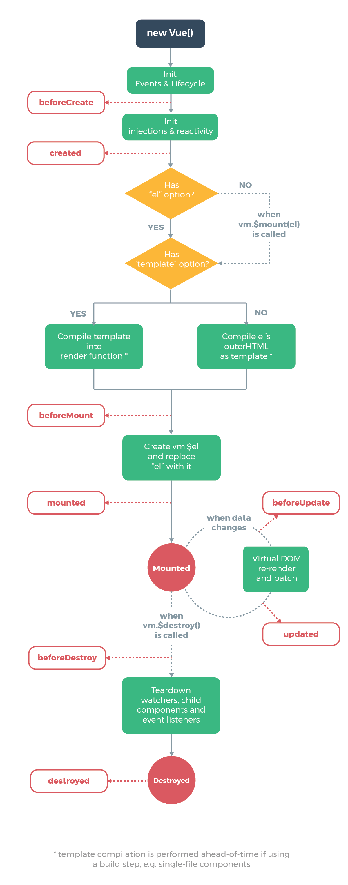

#Vue进阶 {ignore=true}

[toc]

#Vue组件体验

## 组件概述

相对于页面，组件是一个更小的开发单元，一个组件包括：

- 组件功能（js代码）
- 组件视图（模板代码，类似于html代码）
- 组件样式（css代码）

组件开发的优势：

- 复用
- 分解复杂度
- 更精细的测试

## 创建和使用组件

### 创建组件

组件的本质，是一个普通的JS对象，对象中书写组件的配置，其配置和Vue实例的配置大致相同，但又有所区别：

- data是一个函数，而不是对象
- 模板视图不在页面，而在组件的template配置中
- 组件具有name属性，通过该属性可以指定组件的名称，这通常会用于调试，而非真实使用时的名称

### 使用组件

一个组件可以在Vue实例或另一个组件中被使用。

要使用组件，必须先注册它。

注册组件分为**全局注册**和**局部注册**

**全局注册**

使用```Vue.component("组件名", 组件对象)```全局注册组件，该代码运行之后，所有的其他组件或Vue实例都可以用该组件了。

> 当使用webpack等构建工具时，全局注册的组件始终会出现在打包结果中，会导致最终代码量增加，除非某些组件大量被使用，否则应该尽量避免全局注册。

**局部注册**

在另一个组件中，或Vue实例中，要使用一个组件时，可以通过```components```配置注册该组件，这种方式叫做局部注册。

```js
{
    //其他配置...
    components:{
        组件名:组件对象
    }
}
```

**组件名**

无论是全局注册，还是局部注册，组件名有两种命名规范：

- 使用 kebab-case 命名法（短横线命名法、烤串命名发）：推荐使用该命名法，这种命名能够被浏览器识别，并且兼容web-component标准
- 使用 PascalCase 命名法（首字母大写的驼峰命名法）：使用这种命名法后，使用组件时可以同时使用该名称和kebab-case命名。

**在模板中使用**

组件定义并完成注册后，模板中可以直接使用该组件，使用方式是：

```
<组件名></组件名>
```

> 不要忘记，组件是可以被各种嵌套使用的。

### 组件树


组件的嵌套关系，会最终形成一棵组件树，树具有一个根节点，我们称之为根组件。

我们通常这样处理页面上的组件：

- 按照需求，组件之间进行嵌套
- 所有的组件，最终都被根节点嵌套
- Vue实例中渲染根节点即可

在Vue实例中，可以通过render函数动态渲染内容。

```js
{
    new Vue({
        render: h=>h(根组件对象)
    }).$mount("#app")
}
```

# Vue和Webpack

直接在页面上使用Vue不是一种很好的做法，这会遇到一些老问题：

- 兼容性
- 文件分离，最好一个文件一个组件

因此，一个专业的Vue工程，需要配合Webpack使用

## 自行搭建工程

在之前的webpack工程基础上，继续配置Webpack，使其支持Vue

1. 安装vue

```cmd
cnpm i -S vue
```

2. 安装vue-loader：[](https://vue-loader.vuejs.org/zh/guide/)

```
npm install -D vue-loader vue-template-compiler
```

vue-loader用于加载后缀名为```.vue```的组件（稍后介绍），vue-template-compiler用于完成组件的编译

3. webpack配置：

```js
// webpack.config.js
const VueLoaderPlugin = require('vue-loader/lib/plugin')

module.exports = {
  module: {
    rules: [
      // ... 其它规则
      {
        test: /\.vue$/,
        loader: 'vue-loader'
      }
    ]
  },
  plugins: [
    // 请确保引入这个插件！
    new VueLoaderPlugin()
  ]
}
```

> 注意：css加载器需要配置为：vue-style-loader

4. 制作单文件组件

- 单文件组件后缀名为vue
- 单文件组件使用template、script、style三个元素将模板视图、功能、样式在组件内部分离
  - template元素中书写组件的模板，注意单个根节点
  - script元素中导出组件对象
  - style元素中书写组件样式，若添加scoped属性，则表示该样式仅用于该组件内部，会开启css modules，不会污染全局样式
- 通常情况下，./src/App.vue会作为整个应用的根组件，其他的组件放到./src/components/目录下
- 后缀名为.vue的组件会被vue-loader加载器处理，在处理的过程中，会用到vue-template-compiler对文件内容进行编译
- vue组件中的样式内容会被vue-style-loader加载器处理

## 使用Vue CLI搭建工程

虽然手动使用webpack创建工程能够获得最大的灵活度，但却过于麻烦，我们通常使用Vue的官方脚手架来搭建工程

> 教程：https://cli.vuejs.org/zh/guide/

- Vue CLI 会自动安装webpack及其插件，并完成合适的配置
- 除了之前学习webpack时安装的插件之外，它还额外安装了ESLINT，它是一个代码风格检查器，会自动找出我们代码中不合理的代码，并给与警告或错误
- webpack的大部分配置，已融入vue.config.js
- 如果要进行额外的配置，参考：https://cli.vuejs.org/zh/config/

# 深入理解组件

## 组件属性

组件的一部分数据来自自身的data，而另一部分数据来自属性props


props的特征：

- 和data一样，props会被挂载到组件的实例上
- 在计算属性中，也可以使用像使用data那样使用props
- 切记：props不能被组件所改变

props具有以下的可操作性：

- prop的大小写：传递属性时，推荐使用kebab-case命名法
- prop的类型是可配置的：https://cn.vuejs.org/v2/guide/components-props.html#Prop-%E7%B1%BB%E5%9E%8B
- prop是可以被验证的：https://cn.vuejs.org/v2/guide/components-props.html#Prop-%E9%AA%8C%E8%AF%81
- 非prop属性会被附加到组件根节点：https://cn.vuejs.org/v2/guide/components-props.html#%E9%9D%9E-Prop-%E7%9A%84%E7%89%B9%E6%80%A7

## 组件事件

- 在合适的时候，组件会触发一些事件，该事件组件不知道该如何处理，应该交付给组件的调用者处理
- 通过```this.$emit("事件名", 参数)```来触发组件事件，而调用者通过常规事件注册处理事件
- 特殊事件名
  - ```this.$emit("update:属性名", 值)```，触发该事件，会将新的值传递到父组件通过```sync```修饰符绑定的对应的属性数据
  - ```this.$emit("input", 值)```，触发该事件，配合value属性值，可以达到v-model的效果。实际上，v-model就是这样完成的。
- 理解vue中的双向绑定并非是真正的双向绑定
  - 真正的双向绑定会带来数据维护上的困难，数据到底是被谁更改了？
  - 易维护的数据总是单向流动的，从父组件流动到子组件
  - vue中通过语法糖来模拟双向的数据绑定，而并非真正的双向绑定

## 组件/页面生命周期



## 组件的插槽

在组件中使用slot，可以在调用组件时，将组件内容传递给组件的slot位置

- 默认插槽
- 插槽默认值：当没有给插槽赋值时，使用默认值
- 具名插槽：具名插槽的出现，可以让组件具备多个插槽，具名插槽可以使用#缩写
- 作用域插槽

## 动态组件

- component是一个特殊的组件，用于显示其他组件
- 通过is可以设置要显示的组件对象（或全局注册的组件名）

## keep-alive

keep-alive是一个特殊的组件，它可以将内部的其他组件缓存起来，即便该被销毁时也不会被销毁，这样可以保存那些暂时无法显示的组件状态。

## ref

- 类似于页面元素的id，通过ref可以获取到组件对象


