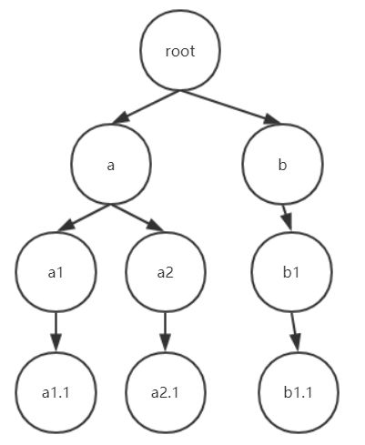
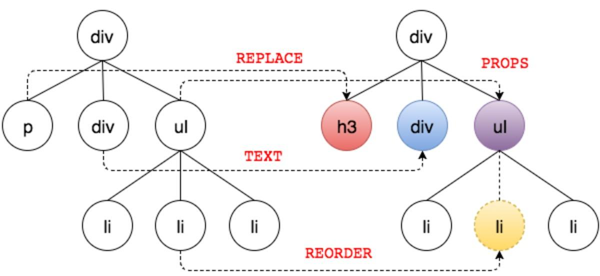
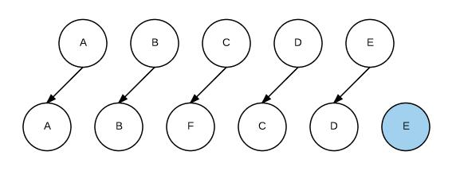
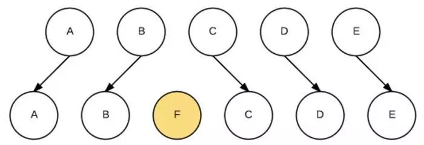

#Vue高级 {ignore=true}

[toc]

# 深入响应式原理

https://cn.vuejs.org/v2/guide/reactivity.html

# 虚拟DOM树（Virtual DOM）

> 阅读：https://www.jianshu.com/p/af0b398602bc

## 渲染流程

当首次渲染，或数据改变后重新渲染时，会经过以下的步骤：

1. 根据当前的数据，生成一棵虚拟dom树

2. 对比改变前后的两棵树，找出差异（diff算法，差分算法），将差异保存到差异对象中

3. 根据差异对象，最终完成真实的dom渲染

## key值

当对比两棵树时，对于一些兄弟节点，若增加或删除了某个节点、或改变了节点的顺序，导致两棵树节点不一致，会导致额外的渲染花销

解决办法是给节点添加key值，在对比时让vue知道如何进行比较

**key值的作用，是让虚拟dom树在对兄弟节点进行比较时，寻求最少的差异，以提高渲染效率**

## 组件的更新

Vue的组件可能依赖一些属性，当属性的数据发生变化时，会导致组件更新，若组件的属性没有变化，组件不会更新

# 自定义指令

> https://cn.vuejs.org/v2/guide/custom-directive.html

# 过滤器

https://cn.vuejs.org/v2/guide/filters.html

# 使用watch观察数据变化

https://cn.vuejs.org/v2/guide/computed.html#%E4%BE%A6%E5%90%AC%E5%99%A8

# 动画和过渡

https://cn.vuejs.org/v2/guide/transitions.html

# 配置代理

https://cli.vuejs.org/zh/config/#devserver-proxy