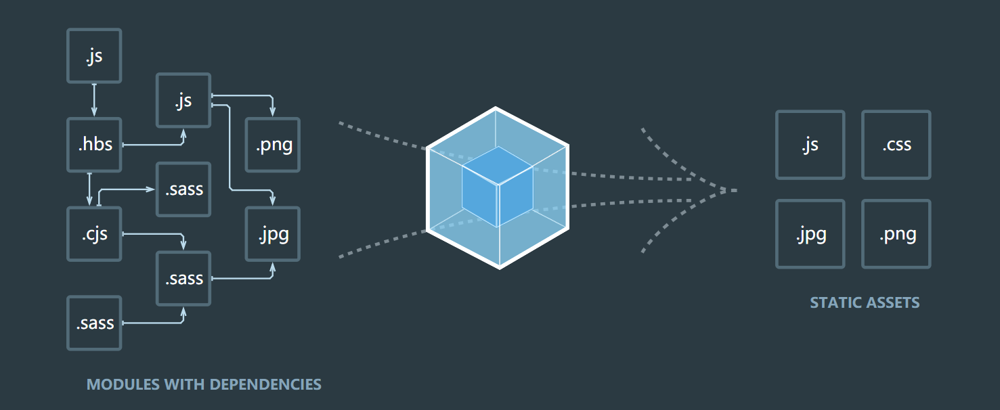
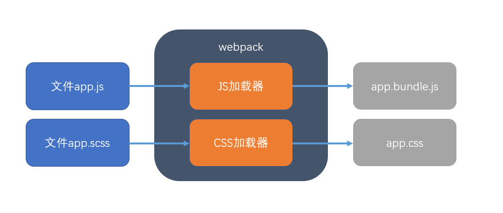

# webpack指南 {ignore=true}

[toc]

> webpack官网：https://www.webpackjs.com/

# webpack概述

## 浏览器环境中的困境

- 如何分离代码以达到模块化的效果？
    - ES6的模块化标准会有兼容性问题
    - ES6的模块化会导致更多的请求发生，影响效率
- 如何解决浏览器兼容问题？
- 当一个页面要引入非常多的js文件，如何管理它们的依赖关系

## 前端构建工具

前端构建工具，是主要用于将分散的项目文件打包、压缩、合并的工具。

常见的构建工具：Grunt、Gulp、**Webpack**

## webpack

> 根据官网的定义：webpack是一个模块打包器，它的主要目的，是让打包的JS文件可以顺利在浏览器中执行；同时，它也能够进行内容转换、打包其他资源。



- webpack是目前最流行的前端构建工具，众多前端框架的官方脚手架都使用了webpack
- webpack拥有大量的插件和加载器，组成了完整的构建生态
- webpack运行在node环境中
- webpack本身的作用，是根据入口文件读取模块依赖关系，形成依赖关系图，然后对JS代码完成简单的打包，更多的功能需要依靠加载器和插件完成
- 学习webpack，不仅可以获得构建web工程的能力，同时对理解或改进一些前端框架的脚手架也有帮助

# webpack安装

使用命令：```cnpm i -D webpack webpack-cli```完成webpack和webpack-cli的安装

安装完成后，可通过```npx webpack -v```查看webpack版本

- webpack是核心包，包含了webpack的所有功能
- webpack-cli是其命令行工具，它可以让你使用一些命令完成相关操作
- npx是npm v5.2.0后引入的一个命令，它可以执行当前工程node_moduels中的命令，常常用于执行没有全局安装的命令
- 使用-D表示--save--dev，因为webpack是在开发阶段用于打包的，打包完成后，在真实的执行环境中就不需要它了，因此没有必要安装为项目依赖，使用开发依赖即可。

> 某些教程让你对webpack进行全局安装，其实没必要，webpack是跟工程紧密相连的，并且全局安装不利于版本控制，因此在工程中安装即可
> 使用taobao镜像可以解决网络慢的问题：http://npm.taobao.org/

# 体验webpack打包

在默认情况下，webpack会寻找工程根目录中的```./src/index.js```，将该文件作为入口文件来寻找整个应用程序的依赖关系。

因此，我们建立一个```./src/index.js```文件，书写一些代码。

然后运行```npx webpack```打包试试看

我们看到

- 执行命令显示了打包的结果
- 执行命令报了一个警告，先不用管它
- 自动生成了一个dist目录，默认情况下，webpack会将打包的结果放置到```./dist/main.js```中
- 打包结果中多出来的代码是webpack自动加入的，它主要是为了让浏览器支持模块化，这些代码其实并不多，不用担心它带来的微量空间占用。

# 使用mode

之前，我们看到运行命令后报了一个警告，警告是说：“你打包时没有使用mode选项”

mode选项可以告诉webpack打包的模式，webpack提供了三种模式：

- production：生产环境模式。一般项目开发完成，发布项目的时候使用该模式打包，该模式可以最大化压缩代码，减少资源对空间的占用
- development：开发环境模式。一般在开发阶段调试项目时，使用该模式打包，该模式可以在打包结果中加入一些调试代码，方便开发人员调试。
- none：无环境模式。通常不会使用该模式。

使用下面的命令添加模式选项

```
npx webpack --mode=模式名称
```

> 在开发阶段，使用开发模式；发布项目时，使用生产环境模式。
> 可以在package.json中配置脚本，更加方便的使用命令；
> 关于模式的更多细节，参阅：https://www.webpackjs.com/concepts/mode/

# 配置入口和出口

若将src目录下的index.js文件重命名为app.js会怎么样呢？结果就是webpack命令将无法执行，因为它默认寻找的就是src/index.js。

如果我希望告诉webpack，不要寻找src/index.js，而去寻找src/app.js，或者若我不希望webpack输出文件为main.js，又该怎么办呢？

webpack寻找的某个文件，去编译它，这个文件叫做入口文件(entry)；webpack的编译结果文件，叫做出口文件(output)

你可以通过配置文件修改webpack的默认值

在根目录中创建webpack.config.js，编写如下代码：

```javascript
const path = require("path");

module.exports = {
    mode:"development", //配置打包模式
    entry:"./src/app.js", //配置入口文件
    output:{ //配置出口文件
        path: path.resolve("dist"), //出口文件目录
        filename:"app.bundle.js" //出口文件名
    }
}
```

- webpack默认读取项目根目录下的```webpack.config.js```作为自己的配置文件
- 现在，你可以删除掉package.json中dev的--mode选项了，而build中的--mode选项可以保留，因为命令行中的选项会覆盖掉配置

> webpack涉及到很多很多的配置，虽然可以在命令行中进行指定，但这样会很麻烦。因此使用配置文件来对webpack进行控制，是最好的方案。

**多入口文件**

有的时候，我们可能希望要打包的入口不止一个（自然出口也会不只一个）

比如，网站中的一些公共模块以util.js为入口寻找依赖，而另一些js以app.js为入口寻找依赖，这样就有了两个入口文件，我们可以使用下面的配置来完成

```javascript
const path = require("path");

module.exports = {
    mode:"development",
    entry:{
        app:"./src/app.js", //配置app的入口
        util:"./src/utils/util.js" //配置util的入口
    },
    output:{
        path: path.resolve("dist"),
        filename:"[name].bundle.js"
    }
}
```

- 出口配置中的```[name]```，将被入口文件的名称所替换

**编写页面查看效果**

是时候做一个页面看一看效果了。

其实，做页面看效果非常的简单，我们只需要在任何位置创建一个页面，然后引入打包完成的js即可。

不过，我们通常把页面放到public文件夹中。

# 使用babel获得最大的兼容性

## babel加载器

很多时候，我们都希望开发的系统能够在各种浏览器中顺利的运行，可是有些低版本的浏览器并不支持ES特性，比如ES6。

而我们开发的时候，却可以从新标准中获得最大的开发体验，我们并不想为了兼容性放弃这些体验。

可是兼容性问题又不得不解决。 

这个时候，babel登场了。

babel是一个JS编译器，它能够将新的语法特性编译成兼容性更好的结果。

我们可以从它的官网去体验一下：https://www.babeljs.cn/

babel是一个非常强大的工具，它可以单独安装，而更多的时候，我们是把它和wepack结合使用。

那如何与webpack进行结合呢？webpack提供了一个叫做**加载器** **loader**的挂钩，只要按照webpack的要求编写的模块，都可以成为加载器。

加载器是webpack非常重要的一个概念，事实上，webpack的核心功能，是通过入口文件读取依赖关系，当它把依赖关系图建立好后，会依次加载每个文件。可是webpack对每个文件并不会做什么特殊处理（或者很简单的处理：压缩、合并），如果需要做特殊处理（比如像babel那样进行兼容性编译），需要第三方的工具来完成，而加载器，就是第三方工具结合到webpack中的一种方式。

当webpack拿到文件后，如果发现该文件有对应的加载器，会将文件先交给加载器处理，然后将处理的结果再进行压缩或合并。



所以，我们要在webpack中使用babel，只需要安装babel官方为webpack开发的加载器，然后挂到webpack上即可。

```javascript
cnpm i -D @babel/core babel-loader
```

- 使用-D是因为babel只是在开发阶段完成编译，编译的最终结果中我们并不需要它
- @babel/core是babel的核心包
- babel-loader是babel官方为了适配webpack而开发的加载器

现在，在webpack.config.js中加入下面的配置

```javascript
module:{
    rules:[ //配置加载器规则
        {
            test:/\.js/, //当webpack读取到.js文件的时候
            exclude:/node_modules/, //node_modeuls文件夹中的内容除外
            use: {
                loader:"babel-loader" //将文件交给babel-loader来处理
            }
        }
    ]
}
```

重新运行试试。

> 在webpack.config.js中加入```devtool:false```可以更加清楚的看到打包结果
> devtool的配置会影响开发调试的执行效率，更多详情：https://webpack.js.org/configuration/devtool/#devtool

## babel插件 plugin

此时，你会发现，搞了一大圈，打包的结果并没有什么变化。

这是因为，babel这个东西，也是一个非常非常庞大的体系（哭脸），它本身也是要依靠很多插件来最终完成编译的。比如，箭头函数的转换，就需要箭头函数的编译插件，块级作用域的处理就需要块级作用域的编译插件......

> 猛戳链接查看更多babel插件：https://babel.docschina.org/docs/en/plugins

我们可以安装对箭头函数的处理插件来解决编译问题

安装完成后，不要忘记，需要在webpack.config.js中进行配置：

```javascript
use: {
    loader:"babel-loader", //将文件交给babel-loader来处理
    options:{
        plugins:["@babel/plugin-transform-arrow-functions"]
    }
}
```

使用options，可以对加载器进行额外的配置

根据babel的官方文档，babel也支持在babel.config.js或.babelrc中进行配置，详见：https://babel.docschina.org/docs/en/configuration

## babel预设 preset

可是，我们需要babel转换的东西实在太多了（ES6里面的所有特性都需要转换），难道我们要为每一个新特性去安装一个插件吗？

庆幸的是，babel提供了一种叫做**预设** **preset**的机制，一个预设，对应多个babel插件，比如：@babel/preset-env预设，就对应几乎所有的ES6特性转换插件。因此，我们只需要安装预设就可以了。

> 更多预设查阅：https://babel.docschina.org/docs/en/presets

安装预设：

```
cnpm i -D @babel/preset-env
```

配置.babelrc:

```json
{
    "presets":["@babel/preset-env"]
}
```
默认情况下，该预设可以将ES6的语法编译到ES5，使用.browserslistrc文件可以配置兼容哪些浏览器。

> 配置参考：https://github.com/browserslist/browserslist#readme

## babel-runtime

现在，我们测试一下是否可以使用Promise

你会发现，你用不了Promise、async、await这样的东西

为什么呢？因为@babel/preset-env只能做语法转换，对于新的API（比如新对象、对象的新属性、新函数等）是无法转换的，因为这涉及到需要把不存在的对象构建出来。

那这件事总得解决，而babel-runtime就是来解决这个问题的。

安装babel-runtime:

```
cnpm i -S @babel/runtime @babel/plugin-transform-runtime
```

安装好后，配置.babelrc:

```json
{
    "presets": ["@babel/preset-env"],
    "plugins": ["@babel/plugin-transform-runtime"]
}
```

> 关于babel还有非常非常非常非常多的知识，不过对于初学者，了解到此就足够了

# 生成页面

目前生成的JS文件名称是固定的，这就会造成浏览器缓存问题，因此，我们在出口设置中加入hash值来解决这个问题。

但是这样一来，我们的页面中引用的JS名称会经常变化，很难维护。

为了解决这个问题，我们可以使用```html-webpack-plugin```插件来处理。

**插件**是webpack除了加载器外的另一个外部程序挂载点，插件的功能要比加载器全面。

插件```html-webpack-plugin```具有自动生成页面，并完成JS引用的功能。

安装：

```javascript
cnpm i --D html-webpack-plugin
```

在webpack.config.js中，添加配置：

```javascript
plugins:[
    new HtmlWebpackPlugin()
]
```

再次打包，你会看到dist目录中已经自动生成了index.html，并完成了JS引用

但是，页面上除了JS引用之外，没有任何其他的东西，因此，我们可以在创建插件时对其进行配置。

> 完整的配置文档见：https://github.com/jantimon/html-webpack-plugin

```javascript
new HtmlWebpackPlugin({
    title:"这里是页面标题",
    filename:"home.html", //这里是配置输出的文件名
    template:"public/index.html" //这里是配置页面模板，在模板中可以使用<%= htmlWebpackPlugin.options %>动态读取插件的配置对象
})
```

# 清理dist文件夹

dist文件夹实在太乱了，有很多过去打包的文件，这些文件完全没用了，我们需要一个工具，能够在每次生成的时候帮我们清理dist文件夹

你可以使用```clean-webpack-plugin```插件来完成此功能。

> 文档：https://github.com/johnagan/clean-webpack-plugin

安装：

```
cnpm i -D clean-webpack-plugin
```

参考之前的代码完成配置

再次打包，你会发现世界清净了

# 样式处理

## css加载器

除了babel外，还有很多其他的加载器，来处理项目中的不同问题

现在，我们在工程中加入一个CSS文件index.css，来为页面上的某些元素设置样式

```css
.title{
    font-size: 2em;
    color:red;
}
```

然后在JS代码中引用它：

```javascript
import "./index.css"

export default function(){
    const h2 = document.createElement("h2");
    h2.className = "title";
    h2.innerHTML = "我是一个带颜色的标题"
    document.body.appendChild(h2)
}
```

现在运行将会报错，因为webpack无法处理css文件。

我们可以使用css-loader加载器来处理css文件。

安装css-loader

```
cnpm i -D style-loader css-loader
```

> 参考css-loader官网进行配置：https://github.com/webpack-contrib/css-loader

- css-loader负责处理css文件，拿到处理结果对象，但不会进一步处理
- style-loader负责将处理结果对象转换成页面中的style元素，加入到head元素中。

**开启css module**

有的时候，我们有多个样式文件，它们里面包含了相同的类名，这会造成冲突。

我们可以开启css-loader的module，来解决该问题

更改配置：

```js
{
    test: /\.css$/,
    use: ['style-loader',
        {
            loader: "css-loader",
            options: {
                modules:true //开启 css module
            }
        }
    ],
}
```

更改代码：

```js
import styles from "./index.css"

export default function(){
    const h2 = document.createElement("h2");
    h2.className = styles.title;
    h2.innerHTML = "我是一个带颜色的标题"
    document.body.appendChild(h2)
}
```

打包后观察页面的css类名的变化。

## sass加载器

在书写css代码时，有时我们希望使用一些预编译器，比如sass，那sass代码该如何处理呢

> 在工程中使用scss文件，然后在js中导入

安装loader

```
cnpm i -D node-sass sass-loader
```

- node-sass用于编译sass代码
- sass-loader是专门为webpack开发的加载器

> 使用文档：https://www.npmjs.com/package/sass-loader/v/7.0.0
> 配置时要注意顺序

## 分离CSS文件

有的时候，我们不希望把css代码直接放到style元素中，而需要生成外部的css文件，此时，就可以使用插件```mini-css-extract-plugin```来完成该操作。

> 插件官网：https://github.com/webpack-contrib/mini-css-extract-plugin

安装插件：```cnpm install --save-dev mini-css-extract-plugin```

配置参考其github地址

# 开发服务器

截止目前，我们已经做了不少配置了，但是开发体验还是不尽人意，因为我们的页面是在本地环境中运行的，有的时候，某些功能需要在服务端运行才有效（比如在页面上使用绝对路径），所以，现在，我们的任务是要把页面放到服务器上。

使用```webpack-dev-server```工具便可做到这一切。

> 详情：https://github.com/webpack/webpack-dev-server#readme
> devServer配置：https://webpack.js.org/configuration/dev-server/

安装：参考github页面

使用：
- webpack-dev-server提供了命令行工具```webpack-dev-server```，直接执行即可
- 在package.json中，可以在脚本里运行该工具
- webpack-dev-server默认读取输出文件中的```index.html```
- 使用命令行```--open```选项可以自动打开浏览器
- webpack-dev-server不依赖dist文件夹，它是在内存中构建的页面
- 更改代码会自动刷新页面
- 今后在开发时，只需要启动webpack-dev-server即可，部署发布时，才运行打包命令。

# 打包其他文件资源

现在，js资源由babel处理后webpack打包，css资源由css-loader或sass-loader处理后由MiniCssExtractPlugin.loader负责打包

可是其他文件资源呢？比如图片该如何处理呢？

其他的文件资源webpack无法识别，因此需要使用file-loader加载器处理

> 详情：https://github.com/webpack-contrib/file-loader

# 规划输出目录

通常情况下，我们都需要把最终输出的各种文件分门别类的放到目录中，比如：

- ./script  存放js文件
- ./css 存放css文件
- ./img 存放图片文件

```js
const path = require("path");
const HtmlWebpackPlugin = require("html-webpack-plugin")
const CleanWebpackPlugin = require('clean-webpack-plugin');
const MiniCssExtractPlugin = require("mini-css-extract-plugin");
module.exports = {
    entry: {
        //...
    },
    output: {
        path: path.resolve("dist"),
        filename: "script/[name].[hash].js"
    },
    module: {
        rules: [ 
            //...
            {
                test: /\.css$/,
                use: [{
                        loader: MiniCssExtractPlugin.loader,
                        options: {
                            publicPath: "../"
                        }
                    },
                    {
                        loader: "css-loader",
                        options: {
                            modules: true
                        }
                    }
                ],
            },
            {
                test: /\.scss$/,
                use: [
                    {
                        loader: MiniCssExtractPlugin.loader,
                        options: {
                            publicPath: "../"
                        }
                    },
                    'css-loader', 'sass-loader'
                ],
            },
            {
                test: /\.(png|jpg|gif|svg)$/,
                use: [{
                    loader: 'file-loader',
                    options: {
                        name:"img/[name]-[hash].[ext]"
                    },
                }]
            }
        ]
    },
    plugins: [
        //...
        new MiniCssExtractPlugin({
            filename: "css/[name].[hash].css"
        })
    ]
}
```

# 关于脚手架

配置webpack是一件繁琐的事情，因此，很多框架(vue、react等)都提供了相关的脚手架工具，脚手架会自动帮你搭建webpack环境，并默认安装常用的加载器或插件，同时还帮你完成了各种配置。

因此，利用脚手架可以轻松的搭建工程。

我们将在vue的学习中用到他的脚手架。