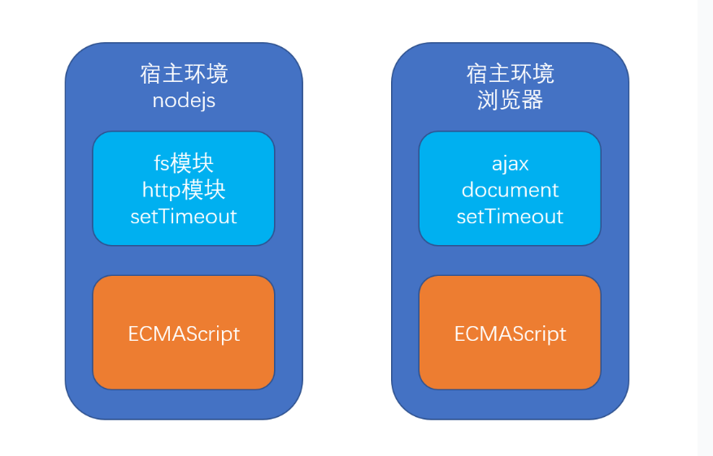

# ES6基础 {ignore=true}

[toc]

# ECMAScript概述

**1. 什么是ES**

ECMAScript（简称ES）是一种由Ecma国际（前身为欧洲计算机制造商协会,英文名称是European Computer Manufacturers Association）通过ECMA-262标准化的脚本程序设计语言。它往往被称为JavaScript或JS，所以它可以理解为是JavaScript的一个标准，但实际上后两者是ECMA-262标准的实现和扩展。

**总结：ES是一种语言标准，他可以运行在不同的宿主环境中**



**2. 版本**

- ES5，2009年12月发布，增加多个数组函数，如map、filter、reduce、includes等
- ES2015，即ES6，**重大更新**，多处语言特性强化
- ES2016，即ES7，增加async和await

**3. 标准制定的各个阶段**

ES标准从提出到最终发布，需要经过下面5个阶段：

- Stage 0 稻草人: 只是一个想法。
- Stage 1 提案: 初步尝试。
- Stage 2 初稿: 完成初步规范。
- Stage 3 候选: 完成规范和浏览器初步实现。
- Stage 4 完成: 将被添加到下一年度发布。

# ES6核心内容

## 常量

**常量**类似于数学中的**常数**，表示在一定周期内，不会改变的数据

在ES6中，定义常量使用```const```关键字

例如：

```javascript
const PI = 3.14; //定义常量PI
PI = 3.1415; //报错，常量的值不可变更
```

## let关键字

使用 var 关键字声明的变量，无论其实际声明位置在何处，都会被视为声明于所在函数的顶
部（如果声明不在任意函数内，则视为在全局作用域的顶部）。这就是所谓的变量提升（
hoisting ）。

```javascript
function getValue(condition) {
	if (condition) {
		var value = "blue";
		// 其他代码
		return value;
	} 
	else {
		// value 在此处可访问，值为 undefined
		return null;
	}
	// value 在此处可访问，值为 undefined
}
```

变量提升会导致一些棘手的问题，比如下面的代码试试看会输出什么，跟你想象的是否一致：

```javascript
for(var i = 0; i < 10; i++){
	setTimeout(function(){
		console.log(i);
	}, 1000)
}
```

为解决这种的问题，ES6新增let关键字，并且**推荐使用let代替var**

**使用```let```关键字声明的变量，在其代码块外无法被访问**

将上面代码中的```var```替换成```let```，试一试效果

> const关键字具备let一样的作用域，并且不可更改

## 箭头函数

**箭头函数是匿名函数的语法糖**

**箭头函数中会改变this的指向，它的this指向与函数外部的this指向相同**

## 默认参数

ES6 能更容易地为参数提供默认值，它使用了初始化形式，以便在参数未被正式传递进来时
使用。例如：

```javascript
function makeRequest(url, timeout = 2000, callback = function() {}) {
	// 函数的剩余部分
}
```

此函数只要求第一个参数始终要被传递。其余两个参数则都有默认值，这使得函数体更为小
巧，因为不需要再添加更多代码来检查缺失的参数值。
如果使用全部三个参数来调用 makeRequest() ，那么默认值将不会被使用，例如：

```javascript
// 使用默认的 timeout 与 callback
makeRequest("/foo");
// 使用默认的 callback
makeRequest("/foo", 500);
// 不使用默认值
makeRequest("/foo", 500, function(body) {
	doSomething(body);
});
```

## 对象代理

思考一个问题：你现在得到了一个对象，比如data，你需要把该对象挂载到另一个对象上，比如app，后续将通过app.data来访问该对象。现在有这么一个需求，当用户访问（读取或修改）app.data对象中的属性时，你要能收到通知，去完成一些额外的事情。

面对这样的场景，对象代理可以轻松搞定

- 对象代理可以控制对目标对象的访问
- 创建代理使用```new Proxy(目标对象, 代理配置对象)```
- 代理配置对象中通常可以配置以下内容
	- set陷阱函数，该函数在设置对象属性时运行，接收4个参数：
		- trapTarget ：将接收属性的对象（即代理的目标对象）；
		- key ：需要写入的属性的键（字符串类型）；
		- value ：将被写入属性的值；
		- receiver ：操作发生的对象（通常是代理对象）
		- 注意：在函数内若要完成赋值，需要使用Reflect.set，该函数和set函数拥有同样的参数
	- get陷阱函数，该函数在读取对象属性时运行，接收3个参数：
		- trapTarget ：将读取属性的对象（即代理的目标对象）；
		- key ：需要读取的属性的键（字符串类型）；
		- receiver ：操作发生的对象（通常是代理对象）
		- 注意：在函数内若要完成赋值，需要使用Reflect.get，该函数和get陷阱函数拥有同样的参数 

## 解构：更方便的数据访问

- 赋值时的解构
- 函数参数的解构
	- 使用默认值

## 异步

**要求1**：学会创建Promise

- Promise是一个构造函数
- new Promise表示创建一个任务
- 需要一个函数作为参数，该函数会立即执行，函数内使用resolve表示成功，reject表示失败
- 练习：
	- 创建一个任务，模拟百米冲刺考试，冲刺时间在一定范围内随机，时间到后任务完成
	- 创建一个任务，使用ajax请求，成功后resolve，失败后reject

**要求2**：得到Promise对象后，学会使用它

- 使用then处理Promise完成后的结果
- 使用catch处理Promise失败后的结果
- 使用链式编程处理链式任务
- 使用Promise.all和Promise.race处理多个任务
- 练习：
	- 使用第一个创建的任务，当冲刺完成后，判定其是否及格
	- 使用第二个创建的任务，当请求成功后，输出响应结果，请求失败后，打印失败的原因
	- 使用第一个创建的任务，当冲刺完成后，判定其是否及格，若及格，则颁发奖项，若不及格，则要求其重考
	- 多次创建第一种任务，当所有考生冲刺完成后，打印排名
	- 学会使用JQuery ajax的Promise格式
	- 学会使用fetch api

**要求3**：学会使用await和async简化代码

- await必须出现在修饰为async的函数中
- await可以等待Promise完成
- 使用try-catch处理异步中的错误
- 修饰为async的函数本身也会返回Promise